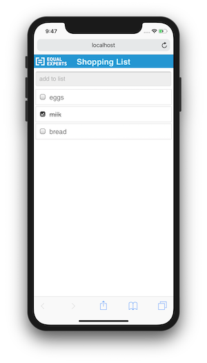

# Shopping List App

A simple shopping list App that saves state on a server



This app has two projects
* `client` for the web front end
* `server` for the back end

## Client
Uses Vue for rendering the UI and VueX for state management. It is quite a heavy solution for the problem, however it provides a good base for future additions which will be required to have a fully functioning shopping list. `src/App.js` is a good starting point.

## Server
A simple express server that can
* get the list
* add to the list
* update item status
`src/server.js` is the main file.

# How to run

## client
In one terminal
```
cd packages/client
npm i
npm run serve
```
Then open a browser at `http://localhost:8080/`

## Server
In another terminal
```
cd packages/server
npm i
npm run dev
```
# Testing
Is done with `jest` just `cd` to the folder and `npm t`

### Some further work if i had the time:
* Handle error cases when communicating with the server
* Handle the loading state when communicating with the server
* Handle the empty state
* Deal with adding the same thing to the list twice
* Removing from / clearing the list

### Instruction version
65713207ceeb79079d357a5d7eb94d29fc12254c